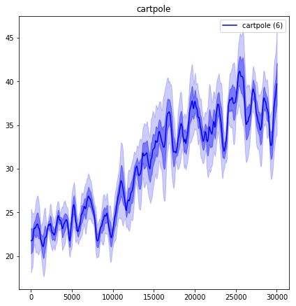
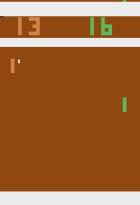
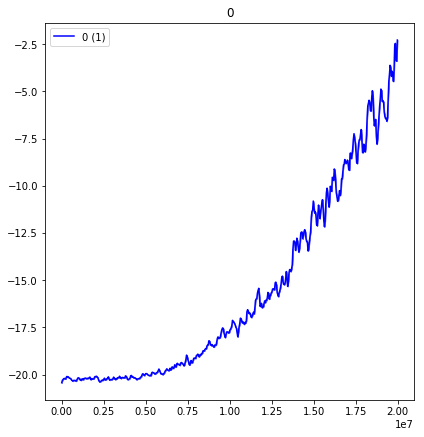
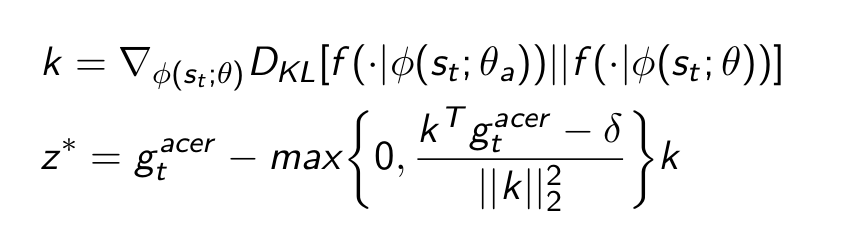

# A3C Acer Demo

This Implementation is based on the OpenAI Baselines implementation
     
```bash
sudo apt-get update && sudo apt-get install cmake libopenmpi-dev python3-dev zlib1g-dev
```
Tested with Tensorflow 1.14
```bash
    pip install tensorflow==1.14
    pip install gym[atari]
```

### Instructions 

Instructions how to run the training can be found in the demonstration.ipynb notebook.
It is also possible to view a trained model.

### Example

The algorithm can be used for different Environments such as the CartPole-v0 or the MountainCar-v0




### Atari Environments

The training in Atari environments is possible but difficult. 
On the environment PongNoFrameskip-v4 it took about 16 hours on a 32-thread cpu to get close to the performance of the rule based pong ai.
This training is based on Vision with a convolutional neural network feeding into a fully connected network. 







### Parameter comparison

Acer can be used with and without efficient Trust Regions, they are supposed to stabilize training.



